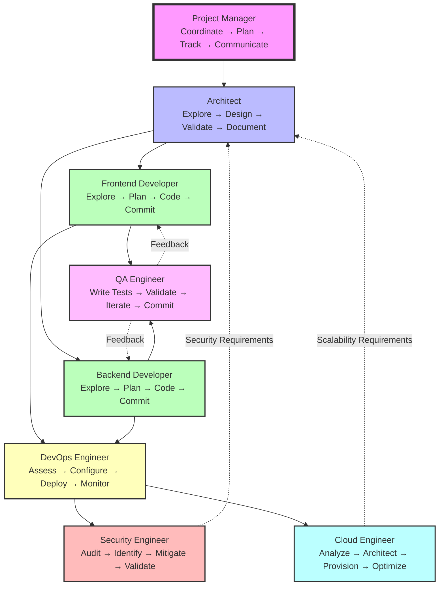

# Multi-Persona Development Team Framework

A prompt engineering template that enables Claude Code to assist with software development through specialized personas, providing structured workflows and organized task management.

## 🚀 Quick Start

**Get started in 30 seconds with one command:**

```bash
curl -fsSL https://raw.githubusercontent.com/kholcomb/ClaudeCode_Prompting_Framework/refs/heads/main/setup-framework.sh | bash
```

*No cloning required! This command downloads and sets up the complete framework in your current directory.*

**Alternative with wget:**
```bash
wget -qO- https://raw.githubusercontent.com/kholcomb/ClaudeCode_Prompting_Framework/refs/heads/main/setup-framework.sh | bash
```

## Table of Contents

- [Quick Start](#-quick-start)
- [Overview](#overview)
- [Key Features](#key-features)
- [Framework Structure](#framework-structure)
- [Getting Started](#getting-started)
- [Setup Guide](#setup-guide)
- [Customization](#customization)
- [Team Personas & Task Workflows](#team-personas--task-workflows)
- [Framework Components](#framework-components)
- [Usage Examples](#usage-examples)
- [Best Practices](#best-practices)
- [Available Commands](#available-commands)
- [Troubleshooting](#troubleshooting)

## Overview

This framework is a **prompt engineering template** designed to enhance how Claude Code assists with software development projects. By providing structured instructions in CLAUDE.md, it enables Claude to operate with persona-based expertise, similar to working with a specialized development team.

### What This Framework Is

- **A directory structure template** with organized folders for specifications, artifacts, and project code
- **A comprehensive CLAUDE.md file** that instructs Claude Code on persona-based development workflows
- **A session management approach** for maintaining context across Claude Code interactions
- **A methodology** for organizing complex development projects with AI assistance

### What This Framework Is NOT

- Not standalone software or an application
- Not an automated system that runs independently
- Not a replacement for actual development tools
- Commands mentioned (like `/pm`, `/architect`) are conceptual - actual usage depends on Claude Code's features

### Why Use This Framework?

- **Specialized Responses**: Claude adopts specific expertise based on the active persona
- **Structured Workflows**: Each persona follows defined processes for consistency
- **Organized Development**: Clear separation of concerns across different aspects
- **Context Persistence**: Session state helps maintain continuity across interactions
- **Better Documentation**: Structured approach to maintaining project documentation

## Key Features

### Autonomous Persona Architecture
- Each persona operates as an independent agent capable of parallel execution
- True concurrent development through git worktrees and sub-agent delegation
- Filesystem-level isolation prevents conflicts during parallel development
- Sub-agent spawning for complex task subdivision and parallel implementation
- Asynchronous coordination through message queues and contracts

### Persona-Based Development
- 8 specialized personas covering all aspects of modern software development
- Each persona follows specific workflows optimized for their responsibilities
- Enhanced exploration phases with mandatory codebase analysis
- Clear handoffs and contract-based communication between personas

### Intelligent Context Management
- Efficient mode for token optimization during long sessions
- Smart context pruning strategies
- Worktree-aware session state tracking with cross-worktree coordination
- Sub-agent relationship preservation and recovery
- Independent context isolation per worktree and persona

### Quality Focus
- Quality checkpoints defined in each persona's workflow
- Testing strategies incorporated into development process
- Code review considerations built into persona behaviors
- Security and performance awareness in relevant personas

### Documentation Structure
- Organized specifications in dedicated directories
- Contract templates for consistent API documentation
- Architecture documentation guidelines
- Clear structure for requirements tracking

## Framework Structure

### Directory Layout

```
multi_agent_prompting_framework_template/
├── README.md                    # This file
├── CLAUDE.md                    # Framework configuration and instructions
├── CHANGELOG.md                 # Version history and changes
├── VERSION                      # Current framework version
├── LICENSE                      # MIT License
├── SECURITY.md                  # Security policy
├── .github/                     # GitHub configurations
│   └── dependabot.yml          # Automated dependency updates
├── .claude/                     # Claude Code command templates
│   └── commands/               # Custom command definitions (includes worktree.md)
├── artifacts/                   # Generated artifacts and contracts
│   ├── contracts/              # Interface contracts between components
│   │   ├── api/               # API contracts
│   │   ├── data/              # Data model contracts
│   │   ├── infrastructure/    # Infrastructure contracts
│   │   ├── security/          # Security contracts
│   │   └── testing/           # Testing contracts
│   └── deliverables/          # Completed project deliverables
├── logs/                       # Session management and logging
│   ├── session-state.json     # Current session state
│   ├── archive/              # Historical session logs
│   └── checkpoints/          # Session recovery points
├── project/                   # Actual project code
│   ├── src/                  # Source code
│   ├── tests/                # Test suites
│   ├── docs/                 # Project documentation
│   └── config/               # Configuration files
├── specs/                     # Project specifications
│   ├── architecture.md       # System architecture
│   ├── requirements.md       # Project requirements
│   ├── constraints.md        # Technical constraints
│   ├── dependencies.md       # External dependencies
│   ├── project-plan.md       # Project planning
│   ├── apis/                 # API specifications
│   └── design/               # Design documents
├── templates/                 # Reusable document templates
│   ├── CLAUDE.md
│   ├── api-contract-template.md
│   ├── feature-spec-template.md
│   ├── persona-coordination-template.md
│   ├── status-report-template.md
│   └── task-template.md
└── worktrees/                 # Git worktree management for parallel development
    ├── README.md              # Worktree usage documentation
    └── shared-state/          # Cross-worktree coordination
        └── coordination.json  # Message queue and synchronization
```

### Workflow Architecture



**Note**: This diagram shows a typical workflow, not a rigid sequence. Roles work in parallel when dependencies allow, and feedback loops (shown as dotted lines) are essential for iterative development. The Project Manager coordinates all roles throughout the process.

### Contract Management System

The framework uses a contract-based communication system:

1. **Contract Lifecycle**: Draft → Active → Deprecated → Archived
2. **Contract Types**: API, Data, Infrastructure, Security, Testing
3. **Version Control**: Semantic versioning with migration support
4. **Dependency Resolution**: Contracts consumed at workflow checkpoints

## Getting Started

### Prerequisites

- Claude Code (or Claude.ai) access
- curl or wget (for downloading the framework)
- Basic understanding of software development workflows
- A project idea or existing codebase to work with

### Initial Setup

```bash
# Quick setup from anywhere - no cloning required
curl -fsSL https://raw.githubusercontent.com/kholcomb/ClaudeCode_Prompting_Framework/refs/heads/main/setup-framework.sh | bash

# Alternative with wget
wget -qO- https://raw.githubusercontent.com/kholcomb/ClaudeCode_Prompting_Framework/refs/heads/main/setup-framework.sh | bash
```

This downloads and sets up the complete framework in your current directory. The setup script will:
- Download all framework files and directories
- Initialize session state
- Optionally set up git in the project/ directory

2. **Set Up Git Repository Structure**:
   ```bash
   # IMPORTANT: Initialize git repository only within the project directory
   cd project/
   git init                       # Initialize git for your actual project
   git add .
   git commit -m "Initial project setup"
   
   # All future git operations should be performed from project/ directory
   # This ensures version control is isolated to your project code
   # The framework files remain outside of your project's git history
   ```

3. **Configure Your Project**:
   ```bash
   # Update project specifications (from framework root)
   # Edit these files to match your project:
   - specs/requirements.md        # Your project requirements
   - specs/project-plan.md        # Timeline and milestones
   - specs/architecture.md        # Initial architecture ideas
   - project/README.md            # Your project's README
   ```

4. **Start Claude Code**:
   ```bash
   # From the framework root directory (not project/)
   claude                         # Or your Claude Code command
   ```

### First Steps with Claude

1. **Initialize the Session**:
   ```
   Human: Let's start working on [your project name]. Can you review the 
   requirements and create an initial project plan?
   
   Claude: [Claude will act as Project Manager and review your specs]
   ```

2. **Set Up Project Version Control** (Important First Step):
   ```
   Human: I need to set up git for my project. Should I initialize it in 
   the framework root or project directory?
   
   Claude: You should initialize git only within the project/ directory. 
   This keeps your project's version control separate from the framework 
   template. Let me help you set that up...
   ```

3. **Work with Specific Personas**:
   ```
   Human: As the architect, can you design the system architecture based 
   on our requirements?
   
   Human: Now as the backend developer, let's implement the user 
   authentication system.
   ```

4. **Check Progress**:
   ```
   Human: What's our current project status? What tasks are in progress?
   ```

## Team Personas & Task Workflows

### Project Manager
**Workflow**: `coordinate → plan → track → communicate`

Responsibilities:
- Break down complex work into manageable tasks
- Coordinate team capacity and dependencies
- Monitor progress and identify blockers
- Facilitate cross-role collaboration
- Maintain project timeline and milestones

### Architect
**Workflow**: `explore → design → validate → document`

Responsibilities:
- Research system requirements and constraints
- Design system architecture and patterns
- Create data models and API contracts
- Validate designs with implementation teams
- Maintain architectural documentation

### Frontend Developer
**Workflow**: `explore → plan → code → commit`

Responsibilities:
- Analyze UI/UX requirements
- Design component architecture
- Implement responsive interfaces
- Handle client-side state management
- Ensure accessibility and performance

### Backend Developer
**Workflow**: `explore → plan → code → commit`

Responsibilities:
- Design APIs and database schemas
- Implement business logic
- Handle authentication and authorization
- Optimize database queries
- Maintain API documentation

### QA Engineer
**Workflow**: `write tests → validate → iterate → commit`

Responsibilities:
- Create comprehensive test strategies
- Implement automated testing
- Execute testing protocols
- Validate requirements compliance
- Maintain quality metrics

### DevOps Engineer
**Workflow**: `assess → configure → deploy → monitor`

Responsibilities:
- Design CI/CD pipelines
- Configure environments
- Execute deployments
- Monitor system performance
- Maintain infrastructure documentation

### Security Engineer
**Workflow**: `audit → identify → mitigate → validate`

Responsibilities:
- Conduct security audits
- Identify vulnerabilities
- Implement security controls
- Validate security measures
- Maintain compliance documentation

### Cloud Engineer
**Workflow**: `analyze → architect → provision → optimize`

Responsibilities:
- Analyze scalability requirements
- Design cloud infrastructure
- Provision cloud resources
- Optimize cost and performance
- Monitor resource utilization

## Framework Components

### Session State Management

The framework maintains persistent state in `logs/session-state.json`:

```json
{
  "session_info": {
    "session_id": "unique-session-id",
    "project_name": "My Project",
    "current_phase": "development"
  },
  "personas": {
    "project_manager": {
      "status": "active",
      "current_workflow_stage": "track",
      "task_queue": {
        "active_tasks": ["Task 1", "Task 2"],
        "queued_tasks": ["Task 3"],
        "completed_tasks": ["Task 0"],
        "blocked_tasks": []
      },
      "task_management": {
        "task_priorities": ["high", "medium", "low"],
        "current_focus": "Task 1",
        "task_dependencies": {"Task 2": ["Contract API-v1.0"]}
      }
    }
  },
  "contracts": {
    "active": ["api-v1.0.0", "data-models-v1.0.0"]
  },
  "context_management": {
    "mode": "efficient",
    "context_usage_estimate": "high",
    "compression_active": true
  },
  "persona_coordination": {
    "active_personas": [
      {
        "persona": "frontend_developer",
        "task_id": "dashboard-ui",
        "working_files": ["src/Dashboard.jsx"],
        "task_focus": "Component implementation"
      }
    ],
    "message_queue": [],
    "handoff_points": {"pending": [], "completed": []},
    "task_coordination": {
      "cross_persona_dependencies": {},
      "shared_task_artifacts": [],
      "coordination_points": []
    }
  },
  "git_context": {
    "branch": "feature/dashboard",
    "modified_files": ["src/Dashboard.jsx", "tests/dashboard.test.js"],
    "last_commit": "abc123"
  },
  "progress": {
    "overall_completion": 35,
    "current_milestone": "MVP Development"
  }
}
```

### Enhanced Features (v1.2.0)

- **Context Management**: Intelligent optimization for long sessions
- **Persona Coordination**: Parallel execution with message queues and task management
- **Task Management**: Comprehensive task queues with priority and dependency tracking
- **Git Context**: Minimal tracking for multi-branch development
- **Multi-Branch Support**: Personas can work on different branches simultaneously
- **Cross-Persona Dependencies**: Structured task handoffs and coordination protocols

### Contract Management

Contracts define interfaces between system components:

1. **API Contracts**: RESTful/GraphQL endpoint specifications
2. **Data Contracts**: Shared data model definitions
3. **Infrastructure Contracts**: Deployment and scaling requirements
4. **Security Contracts**: Authentication and authorization specifications
5. **Testing Contracts**: Test coverage and quality requirements

### Quality Assurance Integration

Quality checkpoints are built into each workflow:

- Code review before commits
- Automated testing requirements
- Documentation updates with code changes
- Security validation for sensitive changes
- Performance testing for critical paths

## Usage Examples

### Example 1: Starting a New Project

```
Human: I need to build a task management application with user authentication, 
real-time updates, and mobile support.

Claude: I'll help coordinate the development of your task management application.
Operating as the Project Manager, let me break this down into phases:

First, let's ensure your project has proper version control setup:
- Initialize git repository in project/ directory only
- Set up initial project structure

[Claude creates a project plan in specs/project-plan.md]
[Updates session-state.json with project information]
[Guides through git initialization in project/ directory]

Now, as the Architect, I'll design the system architecture. Let me explore 
the requirements and create the foundational design...

[Claude creates architecture documents and API contracts]
```

### Example 2: Implementing a Feature

```
Human: As the frontend developer, implement the task creation form

Claude: As the Frontend Developer, I'll implement the task creation form. 
First, let me check the API contract for the task creation endpoint...

[Claude reviews contracts in artifacts/contracts/api/]
[Implements component in project/src/]
[Creates tests in project/tests/]
[Commits changes to git in project/ directory]
[Updates session state with progress]
```

### Example 3: Setting Up Infrastructure

```
Human: We need a DevOps engineer to set up the CI/CD pipeline

Claude: As the DevOps Engineer, I'll set up a comprehensive CI/CD pipeline. 
Let me assess the project structure and requirements...

[Claude creates pipeline configuration in project/config/]
[Documents deployment process in project/docs/]
[Updates infrastructure contracts in artifacts/]
[Commits pipeline configuration to project git repository]
[Sets up GitHub Actions workflows in project/.github/]
```

## Best Practices

### Role Selection
- Use PM role for planning and coordination
- Activate specific roles for implementation tasks
- Switch to meeting mode for cross-role decisions
- Let roles work independently when possible

### Parallelization Strategies
- Identify independent work streams suitable for worktree isolation
- Use contracts to define interfaces early between isolated work streams
- Document assumptions for validation across worktrees
- Minimize blocking dependencies through sub-agent delegation
- Leverage worktree filesystem isolation to prevent conflicts
- Coordinate through message queues in shared-state for integration points

### Session Management
- Commit work regularly to preserve state across all worktrees
- Use checkpoints before major changes or worktree integration
- Review session state when resuming work to restore worktree context
- Clear completed tasks and cleanup unused worktrees to maintain focus
- Monitor sub-agent coordination and resolve integration conflicts

### Documentation
- Keep specifications up to date
- Use templates for consistency
- Link code changes to documentation
- Maintain traceability throughout development

## Setup Guide

### Framework Setup Script

The framework includes a comprehensive setup script (`setup-framework.sh`) that provides both local and remote installation capabilities.

#### Setup Script Features
- **Remote Setup**: Download and initialize framework from GitHub without cloning
- **Local Setup**: Initialize framework from existing local files  
- **Interactive Configuration**: Choose personas, project settings, and development environment
- **Automatic Structure**: Creates complete directory structure and session management
- **VS Code Integration**: Optional workspace configuration and recommended extensions
- **Helper Scripts**: Generates validation and reset utilities
- **Session Management**: Initializes session state with proper persona configuration

#### Setup Script Usage

**Local Setup**:
```bash
# From framework directory
./setup-framework.sh
```

**Remote Setup**:
```bash
# From any directory
curl -fsSL https://raw.githubusercontent.com/kholcomb/ClaudeCode_Prompting_Framework/refs/heads/main/setup-framework.sh | bash -s -- --remote
```

**Setup Options**:
- **Quick Setup**: Default configuration with all personas enabled
- **Custom Setup**: Choose specific personas, project name, VS Code config, git initialization

**Generated Files**:
- `.claude/commands/`: Claude Code command templates for all personas
- `logs/session-state.json`: Active session configuration
- `reset-session.sh`: Session reset utility
- `validate-setup.sh`: Setup validation tool
- Complete directory structure for organized development

### Understanding the Framework Structure

#### The CLAUDE.md File
This is the heart of the framework. It contains:
- Role definitions and responsibilities
- Workflow instructions for each role
- Coordination rules between roles
- Session management instructions

**Important**: Claude reads this file to understand how to behave. Any changes directly affect Claude's responses.

#### Session State Management
The `logs/session-state.json` file tracks:
- Active roles and their current tasks
- Project progress and milestones
- Decisions and assumptions made
- Dependencies between components

**Note**: This file is automatically managed by Claude during conversations.

#### The .claude Directory
Contains command templates that you can reference, though actual command implementation depends on your Claude Code version.

### Configuration Best Practices

1. **Project Specifications**:
   - Be specific in requirements.md - vague requirements lead to assumptions
   - Include technical constraints early (language, frameworks, deployment)
   - Define clear success criteria

2. **Working with Claude**:
   - Start sessions from the framework root, not subdirectories
   - Be explicit about role switches: "As the [role], ..."
   - Save important decisions by asking Claude to document them
   - Use "What's the current status?" to sync understanding

3. **Session Management**:
   - Long sessions may lose context - periodically ask for status summaries
   - Important decisions should be saved to specs/ for persistence
   - The session state helps, but isn't a replacement for documentation

### GitHub Integration

The template includes GitHub configurations:

1. **Dependabot** (`.github/dependabot.yml`):
   - Customize the `reviewers` field with your GitHub username
   - Adjust update schedules as needed
   - Remove package ecosystems you don't use

2. **Setting Up Your Repository**:
   ```bash
   # After creating your GitHub repo (from within project/ directory)
   cd project/
   git remote add origin https://github.com/yourusername/your-project.git
   git branch -M main
   git push -u origin main
   
   # Create development branch
   git checkout -b development
   git push -u origin development
   ```

3. **Recommended GitHub Settings**:
   - Enable branch protection for `main`
   - Require PR reviews for merges
   - Enable Dependabot security updates
   - Set up GitHub Actions for CI/CD (add your own workflows)

## Customization

### Adapting Roles and Workflows

#### Adding a New Role

1. **Update CLAUDE.md** with the new role:
   ```markdown
   ### **Data Scientist**
   **Workflow**: `analyze → model → validate → deploy`
   **Responsibilities:**
   - Analyze data requirements and patterns
   - Design and implement ML models
   - Validate model performance
   - Deploy models to production
   ```

2. **Update session-state.json** template to include the role

3. **Create relevant contract templates** if needed

#### Modifying Existing Workflows

To change how a role operates:
1. Locate the role in CLAUDE.md
2. Adjust the workflow stages
3. Update responsibilities
4. Test with Claude to ensure it understands

### Technology-Specific Customization

#### For Web Applications
- Add `specs/frontend-framework.md` for UI guidelines
- Create `artifacts/contracts/ui/` for component contracts
- Include responsive design requirements

#### For APIs
- Use `specs/apis/` extensively for endpoint documentation
- Create detailed API contracts early
- Include authentication/authorization specs

#### For Microservices
- Add service boundaries to architecture.md
- Create inter-service contracts
- Document deployment strategies

### Common Customizations

1. **Remove Unused Roles**:
   - Delete role sections from CLAUDE.md
   - Remove from session-state.json template
   - Focus on roles relevant to your project

2. **Add Domain-Specific Contracts**:
   ```bash
   # Example for e-commerce
   mkdir artifacts/contracts/payment
   mkdir artifacts/contracts/inventory
   ```

3. **Integrate with Your Tools**:
   - Add tool-specific instructions to CLAUDE.md
   - Create templates for your stack
   - Document integration points

## Important Notes

### Claude-Specific Nuances

1. **Context Window Limitations**:
   - Claude has a limited context window
   - Long sessions may lose earlier details
   - Periodically summarize and save important decisions

2. **CLAUDE.md Interpretation**:
   - Claude treats CLAUDE.md as authoritative instructions
   - Changes take effect immediately in new conversations
   - Test changes with small interactions first

3. **Session Persistence**:
   - Session state persists within a conversation
   - New conversations require context setting
   - Important: "Continue where we left off" requires you to provide context

4. **Role Switching**:
   - Be explicit: "As the [role]" or "Switch to [role]"
   - Claude maintains role context during switches
   - Avoid rapid role changes in single messages

### Framework Limitations

1. **Not Magic**:
   - Requires clear communication and guidance
   - Claude can't actually run code or access real systems
   - You must execute suggested commands and report results

2. **Manual Processes**:
   - Git operations need your execution
   - Testing must be run by you
   - Deployments require your action

3. **Documentation vs Reality**:
   - Keep specs updated as project evolves
   - Session state is not a replacement for proper documentation
   - Contracts need manual synchronization with code

## Troubleshooting

### Common Issues and Solutions

**"Claude doesn't seem to follow the roles"**
- Ensure you're starting Claude from the framework root directory
- Check that CLAUDE.md exists and is readable
- Be more explicit with role requests

**"Session state seems lost"**
- Ask: "What's the current project status?"
- Provide context: "We were working on [feature] as [role]"
- Check logs/session-state.json is being updated

**"Claude is making different architectural decisions"**
- Document decisions in specs/ for persistence
- Reference previous decisions explicitly
- Use contracts to lock in interfaces

**"The framework feels too complex for my project"**
- Remove unused roles from CLAUDE.md
- Simplify workflows to match your needs
- Focus on 2-3 key roles initially

**"Git repository setup is confusing"**
- Ensure git is initialized only in project/ directory
- Framework files should not be in your project's git history
- Use separate repositories: framework template vs. your actual project

### Quick Fixes

```bash
# Reset session state
cp logs/session-state.json logs/session-state.backup.json
# Edit session-state.json to reset specific roles

# Start fresh
rm logs/session-state.json
git checkout logs/session-state.json

# Git repository issues (if git was initialized incorrectly)
# Move to correct location and reinitialize:
cd project/
git init
git add .
git commit -m "Initialize project repository"

# Debug role behavior
# Ask Claude: "What is your current role and what workflow stage are you in?"
```

### Getting Help

1. **Framework Issues**:
   - Review this README and CLAUDE.md
   - Check templates/ for examples
   - Examine session-state.json for state issues

2. **Claude Behavior**:
   - Be more explicit with instructions
   - Provide context and examples
   - Reference specific sections of CLAUDE.md

3. **Project-Specific**:
   - Ensure specs/ are clear and detailed
   - Document decisions as you go
   - Use contracts to clarify interfaces

---

## Available Commands

The framework includes several specialized commands to enhance development workflows:

### Core Framework Commands
- `/help` - Display framework help and usage information
- `/status` - Check project status and persona activity
- `/checkpoint` - Create project milestone checkpoints
- `/review` - Request code or design reviews
- `/plan` - Create and update project plans
- `/end-session` - Properly close development sessions

### Development Workflow Commands
- `/dev` - Core development workflow for implementing features
- `/docs` - Documentation synchronization and management  
- `/test` - QA and testing workflows
- `/project:worktree` - Git worktree management for parallel development and sub-agent delegation

### Persona Commands
The framework uses persona-based development instead of individual role commands:
- Request specific personas directly: "As the architect..." or "Acting as the backend developer..."
- Personas automatically follow their defined workflows and SDLC processes
- Multiple personas can work in parallel using the Task tool for coordination

### Example Usage

**Worktree-Based Parallel Development:**
```
Human: Let's work on two features in parallel - frontend team on the new dashboard UI, backend team on API v2

Claude (as PM): I'll coordinate parallel development using worktrees:
- Creating worktree for Frontend persona: /project:worktree action=create persona=frontend_developer branch=feature/dashboard-ui
- Creating worktree for Backend persona: /project:worktree action=create persona=backend_developer branch=feature/api-v2
- Both can work simultaneously in complete isolation

[Activates personas using Task tool in separate worktrees]

Frontend Persona: Working in worktrees/frontend-dashboard-ui/
- Task Queue: Active [Dashboard component], Queued [Navigation updates]
- Can spawn sub-agents for component subdivision

Backend Persona: Working in worktrees/backend-api-v2/
- Task Queue: Active [User endpoints], Queued [Auth middleware]  
- Can spawn sub-agents for different API modules
```

**Sub-Agent Task Delegation:**
```
Human: Implement a comprehensive user authentication system

Claude (as Backend Dev): This is a complex feature that would benefit from parallel implementation:
- Creating worktree: /project:worktree action=create persona=backend_developer branch=feature/auth-system
- Spawning sub-agents: /project:worktree action=spawn-sub-agent task="Implement user authentication system" delegation-pattern=feature_subdivision

[Creates 3 sub-agents working in parallel]
Sub-Agent 1: JWT authentication implementation in worktrees/backend-auth-system-jwt/
Sub-Agent 2: User management endpoints in worktrees/backend-auth-system-users/  
Sub-Agent 3: Password security & validation in worktrees/backend-auth-system-security/

[Parent persona coordinates integration through message queue]
```

**Persona-Based Development:**
```
Human: As the architect, analyze our database requirements and design the schema

Claude (as Architect): I'll design the database schema following the explore → design → validate → document workflow...

[Explores requirements, designs schema, validates with stakeholders, documents in specs/]
```

**SDLC Integration:**
```
Human: Set up our project to use GitFlow methodology

Claude (as Project Manager): I'll configure GitFlow SDLC methodology for the project...

[Updates .sdlc-config.yml, configures branch protection rules, sets up quality gates]
[All personas now follow GitFlow branch strategy and review requirements]
```

## Contributing

This framework is designed to evolve with your development practices:

1. Customize workflows in CLAUDE.md
2. Add new templates as needed
3. Extend contract types for your domain
4. Share improvements with the community

## License

[Your License Here]

---

*The Multi-Agent Development Team Framework - A prompt engineering template for structured, role-based development assistance with Claude Code.*